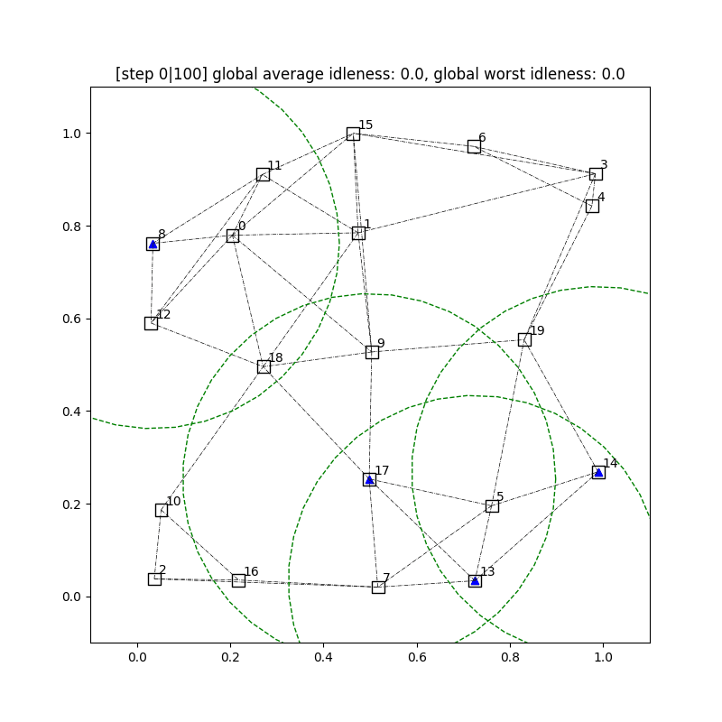
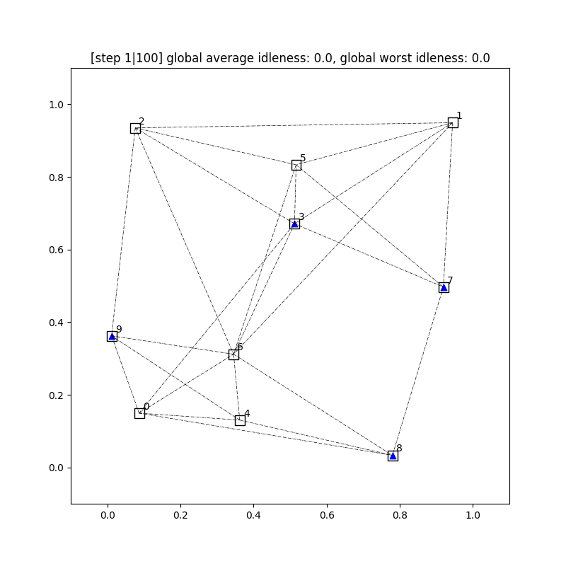

# MARL Patrol — Multi-Agent Deep RL for Patrolling

Multi-agent deep reinforcement learning for the **multi-robot patrolling problem
(MRPP)**: a team of agents must repeatedly visit every point of interest (POI) on
a graph so that no location stays unvisited (high *idleness*) for too long.
Agents cooperate through local communication and are trained with **Proximal
Policy Optimization (PPO)**. The Transformer-based policy ("PatrolNet") is
scalable to different numbers of agents and targets.

<p align="center">
  
  
</p>
<p align="center"><sub>Left: original trained demo. Right: reproduced from this package
(<code>on_node</code>, 4 agents / 10 targets, 400 training episodes) — see
<a href="#reproduce-this-demo">Reproduce this demo</a>.</sub></p>

> **What's new (v0.2).** The three near-duplicate project folders
> (`OnNode_v2`, `OnNode_FixedMap`, `EveryTimeStep`) have been merged into a single
> installable package `marl_patrol`, several crash bugs were fixed, the broken
> dependency files were repaired, and the code was modernized for Python 3.10 /
> PyTorch 2.x / Gymnasium. See [Refactor notes](#refactor-notes).

---

## Two decision paradigms

The two modes share the same world dynamics but differ in **when** agents act:

| Mode | When agents decide | Notes |
| --- | --- | --- |
| `on_node` (default) | Only when an agent is **on a target node**; between nodes it coasts toward its chosen target. | Supports `--fixed-map` to reuse the same graph across episodes (former `OnNode_FixedMap`). |
| `every_timestep` | **Every** simulation step, via `env.step`. | Reward is idleness-based on a node, with a small `-0.1` penalty while in transit. |

The **environment** (graph of POIs, agent movement, idleness, communication,
observation/reward) is otherwise identical and lives in
`src/marl_patrol/envs/`.

---

## Repository structure

```
src/marl_patrol/
├── models/patrol_net.py     # Transformer actor-critic policy (shared)
├── algorithms/ppo.py        # PPO learner (shared)
├── buffers/rollout_buffer.py# on-policy rollout buffer + GAE (shared)
├── envs/
│   ├── on_node.py           # on-node env (+ fixed_map flag)
│   ├── every_timestep.py    # every-timestep env
│   └── render_utils.py      # matplotlib -> RGB frame helper
├── train/
│   ├── common.py            # arg/cfg parsing, batching, device, logging
│   ├── on_node.py           # on-node training & evaluation loop
│   └── every_timestep.py    # every-timestep training & evaluation loop
└── cli.py                   # `marl-patrol` entry point
configs/params.cfg           # network + environment + PPO hyperparameters
tests/test_smoke.py          # fast CPU smoke tests
```

---

## Installation

The code runs on both a **modern** stack (recommended) and the original
**legacy** stack — a gym/gymnasium compatibility shim handles both.

### Modern (recommended, Python ≥ 3.9)

```bash
conda env create -n marl_patrol -f environment.yml
conda activate marl_patrol
pip install -e .
```

or with pip only:

```bash
pip install -r requirements.txt
pip install -e .
```

### Legacy (original versions, Python 3.7/3.8)

```bash
conda env create -n marl_patrol_legacy -f environment-legacy.yml
conda activate marl_patrol_legacy
pip install -e .
```

> `numpy` is pinned `< 2.0` and `networkx` `< 3.0`: the environment relies on
> `np.matrix` / `.A` and the networkx 2.x adjacency-matrix API.

---

## Quick start

All commands go through the `marl-patrol` CLI (installed by `pip install -e .`).
Equivalently, run `python -m marl_patrol.cli ...`.

**Train** (on-node, the default mode):

```bash
marl-patrol --mode on_node --num-episodes 1000
```

**Train** (every-timestep):

```bash
marl-patrol --mode every_timestep --num-episodes 1000
```

**Resume** from the saved best model (suffix defaults to `v2`):

```bash
marl-patrol --mode on_node --load --suffix v2
```

**Evaluate** a trained model and render GIFs:

```bash
marl-patrol --mode on_node --test --render --suffix v2
```

**Reuse a fixed map** across episodes (on-node only):

```bash
marl-patrol --mode on_node --fixed-map
```

### Reproduce this demo

The right-hand GIF above was produced end-to-end from this package (CPU, a few
minutes) with:

```bash
marl-patrol --mode on_node --num-episodes 400 --seed 0 --suffix demo
marl-patrol --mode on_node --test --render --num-tests 1 --suffix demo
# -> results/test/<folder>/agents4-targets10-comms_radiusinf-test0.gif
```

(using a config with 4 agents, 10 targets and `max_episode_steps = 100`).

### CLI options

| Flag | Default | Meaning |
| --- | --- | --- |
| `--mode {on_node,every_timestep}` | `on_node` | Decision paradigm. |
| `--config PATH` | `configs/params.cfg` | Hyperparameter file. |
| `--section NAME` | `single_proc_ppo` | Section within the config. |
| `--test` | off | Evaluate instead of train. |
| `--load` | off | Resume from a saved checkpoint. |
| `--fixed-map` | off | (on-node) reuse the same graph each episode. |
| `--num-episodes N` | `10000` | Number of training episodes. |
| `--episode-segment N` | `200` | (on-node) episodes between phase checkpoints / LR decay. |
| `--num-tests N` | `5` | Episodes to run in `--test`. |
| `--render` | off | Render / record frames. |
| `--greedy / --no-greedy` | greedy | Greedy vs. sampled actions at test time. |
| `--suffix S` | `v2` | Checkpoint suffix to save/load. |
| `--seed N` | none | RNG seed for reproducibility. |

---

## Configuration

`configs/params.cfg` (section `[single_proc_ppo]`) holds the knobs:

- **Network**: `dim_unify` (model width `d`), `repeat_times_inside_net` (encoder
  depth `N`), `heads`, `dim_af` / `dim_cf` / `dim_tf` (agent / connectivity /
  target feature dims).
- **Environment**: `numAgents0..1`, `numTargets0..1`, `numNeighbors0..1`
  (graph k-NN range), `env_size0..1`, `max_episode_steps`.
- **PPO**: `learning_rate`, `gamma`, `gae_lambda`, `batch_size`, `n_epochs`,
  `entropy_coef`, `value_coef`, `surrogate_loss_clip`, `max_grad`, `window_size`.

The per-agent step length (`0.05`) and the on-node distance threshold
`ALPHA` (`1.1`) are constants in `src/marl_patrol/envs/`.

---

## Outputs

Written under `results/<folder_name>/` (git-ignored):

- `results/models/...` — PPO checkpoints (`checkpoint_<suffix>.pth`).
- `results/train/...` — TensorBoard logs (`Perf/episode_reward`,
  `Train/value_loss`, `Train/policy_loss`, …). View with
  `tensorboard --logdir results/train`.
- `results/test/...` — evaluation GIFs named
  `agents{N}-targets{M}-comms_radius{R}-test{i}.gif`.

---

## Development

```bash
pip install -e ".[dev]"
pytest -q                 # fast CPU smoke tests
ruff check src tests      # lint
black src tests           # format
```

## Refactor notes

This version is a structural cleanup of the original research code; the PPO
algorithm, network and reward functions are unchanged. Highlights:

- **Deduplicated** three copies of the model / algorithm / buffer into one
  shared package; folded `OnNode_FixedMap` into an `--fixed-map` flag.
- **Bug fixes**: checkpoint `phase` load crash; mini-batch off-by-one that
  silently dropped samples; `torch.load` without `map_location`; the broken
  `argparse type=bool` flag; crashes in the every-timestep evaluation loop.
- **Modernized**: Python 3.10 / PyTorch 2.x / Gymnasium (with a legacy `gym`
  fallback); robust Matplotlib frame capture; resolved the merge-conflicted
  `requirements.txt` / `patrol.yml`.

---

## Authors

- **Xijia Feng**
- **Jiawei Cao**
- **Yiding Ma**

## License

MIT — see [LICENSE](LICENSE).
